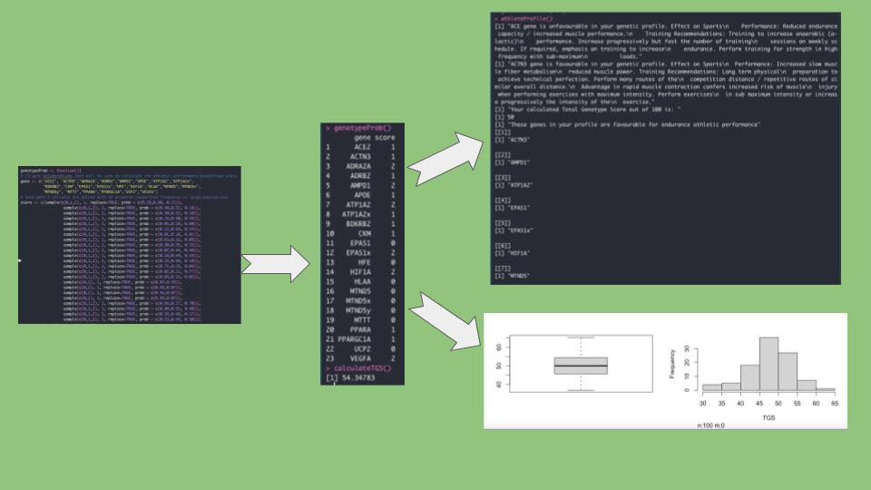

<!-- README.md is generated from README.Rmd. Please edit that file -->

```{r, include = FALSE}
knitr::opts_chunk$set(
  collapse = TRUE,
  comment = "#>",
  fig.path = "man/figures/bcb410",
  out.width = "100%"
)
```

# PerfOMICS

PerfOMICS is an R package that predicts athletic performance scores using user-provided data on major genetic variants known to be associated with specific aspects of sports performance to help profile athletes in terms of endurance, power and speed ability, predict and forecast effects of training programs and provide genetic insights into sports-related injury susceptibility and corrective action.

## Description

The goal of PerfOMICS is to:

1.  Profile athletes in terms of endurance, power and speed.

2.  Predict and forecasting the effects of training programs and strategies.

3.  Provide genetic insights into injury susceptibility, prevention and disease management.							

    This tool can further assist in helping athletes decide their choice of sport or athletic
    activity, maximize athletic potential through tailoring of athletic programs, provide
    guidelines on preventive measures and corrective action for athletes susceptible to
    sports-related injuries.

    The \`PerfOMICS\` package was developed using \`R version 4.1.1 (2021-08-10)\`,

    \`Platform: x86_64-apple-darwin17.0 (64-bit)\` and \`Running under: macOS Big Sur 11.2\`

## Installation

You can install the development version of PerfOMICS like so:

``` r
require("devtools")
devtools::install_github("hjovi1/PerfOMICS", build_vignettes = TRUE)
library("PerfOMICS")
```

## Overview

\`PerfOMICS\` contains 4 functions to demonstrate features of an athletic performance predictor R package. genotypeProb() outputs a set of 23 genotypes with a respective genetic score. calculateTGS(): calculates the total genotype score using the set from genotypeProb(). athleteProfile() generates an individualised athlete polygenetic profile. generateDataSet(n) generates a dataset of n polygenetic profiles to be used for analysis and plots. printGeneInfo() prints information on each gene that is being used in the TGS calculation (name, function, variants and frequencies)

Refer to package vignettes for more details. An overview of the package is illustrated below.

```{r}
#ls("package:PerfOMICS")
#data(package = "PerfOMICS") 
#browseVignettes("PerfOMICS")
```

## Contritbutions

The author of the package is Helena Jovic.

The generateFreqPlot function makes use of the ggplot R package to plot the
frequency distribution of the TGS for n individual polygenic profiles. Other packages
that are used are Hmisc, lattice, survival and Formula. 

## References						

[1] Kambouris, M., Ntalouka, F., Ziogas, G., & Maffulli, N. (2012). Predictive Genomics
DNA Profiling for Athletic Performance. Recent patents on DNA & gene sequences, 6.
doi:10.2174/187221512802717321

[2] Petr M, Thiel D, Kateřina K, Brož P, Malý T, Zahálka F, Vostatková P, Wilk M, Chycki
J, Stastny P. Speed and power-related gene polymorphisms associated with playing
position in elite soccer players. Biol Sport. 2022 Mar;39(2):355-366. doi:
10.5114/biolsport.2022.105333. Epub 2021 Apr 21. PMID: 35309536; PMCID:
PMC8919892.					

[3] Williams AG, Folland JP. Similarity of polygenic profiles limits the potential for elite
human physical performance. J Physiol. 2008 Jan 1;586(1):113-21. doi:
10.1113/jphysiol.2007.141887. Epub 2007 Sep 27. PMID: 17901117; PMCID:
PMC2375556.

[4] Ruiz, J. R., Arteta, D., Buxens, A., Artieda, M., Gómez-Gallego, F., Santiago, C., \...
Lucia, A. (2010). Can we identify a power-oriented polygenic profile? Journal of Applied
Physiology, 108(3), 561--566. doi:10.1152/japplphysiol.01242.2009

[5] H. Wickham. ggplot2: Elegant Graphics for Data Analysis. Springer-Verlag New York, 2016.

[6] Harrell Jr F (2022). _Hmisc: Harrell Miscellaneous_. R package version 4.7-1,
  <https://CRAN.R-project.org/package=Hmisc>.
  
[7] Sarkar, Deepayan (2008) Lattice: Multivariate Data Visualization with R. Springer, New York. ISBN 978-0-387-75968-5

[8] Zeileis A, Croissant Y (2010). “Extended Model Formulas in R: Multiple Parts and Multiple Responses.” _Journal of
  Statistical Software_, *34*(1), 1-13. doi:10.18637/jss.v034.i01 <https://doi.org/10.18637/jss.v034.i01>.

[9] Therneau T (2022). _A Package for Survival Analysis in R_. R package version 3.4-0,
  <https://CRAN.R-project.org/package=survival>.

[10] Terry M. Therneau, Patricia M. Grambsch (2000). _Modeling Survival Data: Extending the Cox Model_. Springer, New York.
  ISBN 0-387-98784-3.


[11] RStudio Team (2022). RStudio: Integrated Development Environment for R. RStudio, PBC, Boston, MA URL
  http://www.rstudio.com/.

## **Acknowledgements**

This package was developed as part of an assessment for BCB410H: Applied Bioinformatics course at the University of Toronto, Toronto, CANADA. `PerfOMICS` welcomes issues, enhancement requests, and other contributions. To submit an issue, use the [GitHub issues](https://github.com/hjovi1/PerfOMICS/issues). Many thanks to those who provided feedback to improve this package.\

```{r}

```

## Assumptions
Genes and genomic variant selection for predicting athletic performance depends upon the individual\'s interpretation of the association studies and the strength of each association. This package should not be taken as real medical advice. The development of the algorithms that take into account genotypes of selected genes, assign \"weight\" values, threshold levels and take into account variant to variant interactions in a DNA-profile-to-trait relation, are proprietary and should be amendable to patent protection, as are the gene and variant selection itself and the individual genotype DNA profiles-to-trait interpretations.
