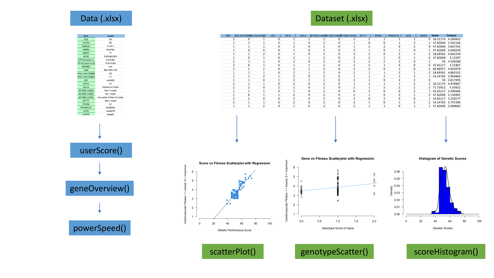

<!-- README.md is generated from README.Rmd. Please edit that file -->

# PerfOMICS

## Description

The purpose of `PerfOMICS` is to provide package users with athletic
performance prediction scores based on major genetic variants known to
be associated with s specific aspects of sports performance and to help
profile athletes in terms of endurance, power and speed ability,
forecast effects of athletic performance, and provide training
recommendations to help maximize athletic potential. This package
visualizes genetic score frequencies in datasets and the relationships
between genetic scores and cardiovascular fitness as well as the
relationships between genetic variants and cardiovascular fitness.

The biological data analysed by `PerfOMICS` are the genotypes and
variants of 23 different genes associated with athletic ability. These
variants all have researched probabilities in large populations. The
data included in this R package has been synthetically synthesized using
information on the frequencies of each genotype for the 23 genes being
analysed. A function responsible for generating a data set using the
researched genotype probabilities.

The \`PerfOMICS\` package was developed using \`R version 4.1.1
(2021-08-10)\`,

\`Platform: x86_64-apple-darwin17.0 (64-bit)\` and \`Running under:
macOS Big Sur 11.2\`

## Installation

You can install the development version of PerfOMICS like so:

``` r
require("devtools")
#> Loading required package: devtools
#> Loading required package: usethis
devtools::install_github("hjovi1/PerfOMICS", build_vignettes = TRUE)
#> Skipping install of 'PerfOMICS' from a github remote, the SHA1 (05fe40e8) has not changed since last install.
#>   Use `force = TRUE` to force installation
library("PerfOMICS")
```

## Running Shiny App

``` r
# Commented to reduce lag in runtime of rendering
# PerfOMICS::runPerfOMICS()
```

## Package Overview

Refer to package vignettes for more details. An overview of the package
is illustrated below.

``` r
ls("package:PerfOMICS")
#> [1] "geneOverview"    "generateDataset" "genotypeScatter" "powerSpeed"     
#> [5] "runPerfOMICS"    "scatterPlot"     "scoreHistogram"  "userScore"
browseVignettes("PerfOMICS")
#> starting httpd help server ... done
```

There are three datasets included in `extdata` folder in `inst` for use
in this package. There are three functions available for individual
analysis: `userScore`, `geneOverview` and `powerSpeed`. There are three
functions available for plotting large datasets: `scatterPlot`,
`scoreHistogram` and `genotypeScatter`. The function `generateDataset`
allows user to create a dataset researched probabilities of genotype
frequencies.

#### `userScore`

To calculate a genetic score on a scale of 0 to 100 of an individual
genetic profile of 23 gene polymorphisms, using an algorithm proposed by
Williams and Folland in 2008. The algorithm is based on researched
associations between certain variants and athletic endurance
performance.

#### `geneOverview`

Provide an overview of a user’s genetic profile by categorizing each
gene’s variant into three buckets: unfavorable, neutral and optimal for
athletic endurance performance.

#### `generateDataset`

This function is used to generate a dataset of number of entries input
by user containing 23 gene polymorphisms associatied with athletic
endurance performance ability as well as a value corresponding to
cardiovascular fitness level for each entry.

#### `powerSpeed`

Provide user a power speed analysis on a genetic profile by checking for
matches between the genetic profile and the optimal variants for genes
associated with power and speed ability. Returns the associated
genotypes in an individual profile, each genotype’s effect on sports
performance and the corresponding recommended training.

#### `scatterPlot`

To visualize a scatter plot of a variable in the provided data set and
the cardiovascular fitness level of each individual in the data set. A
regression line is added to show the trend in the data given in the
scatter plot.

#### `scoreHistogram`

To visualize a histogram of the genetic scores of each individual in the
data set including a density line.

``` r

```


## Contributions

The author of the package is Helena Jovic.

The `readxl` package is used to read in xlsx files for use in the
package.

#### `userScore`

The `readr` package was used to read the csv file containing gene
information of the 23 gene associations with athletic performance. My
contribution for this function is calculating the genetic score of an
individual genetic profile on a scale of 0 to 100 using an algorithm
proposed by Williams and Folland in 2008.

#### `geneOverview`

The `readr` package was used to read in the csv file. `plyr` was used
for data frame manipulation. My contributions for this function are
reading in the data and processing it, such as by extracting information
from columns, and organizing it into an individualized form.

#### `generateDataset`

The `stats` package was used to select a genotype for each gene based on
probabilities. `plyr` was used for data frame manipulation. My
contributions for this function are generating a usable contribued
dataset for this package based on researched probabilities involving 23
genes associatied with athletic performance.

#### `powerSpeed`

The `readr` package was used to read the csv file containing the power
speed analysis. `plyr` was used for data frame manipulation. My
contributions for this function are reading in the data and processing
it, such as by extracting information from columns, and categorizing the
genes based on an individual profile.

#### `scatterPlot`

The `graphics` package was used to visualize a sctterplot using the
score variable in the provided dataset and the cardiovascular fitness
level of each individual in the data set. `stats` was used to add a
regression line to show the trend in the data given in the scatter plot.

#### `scoreHistogram`

The `graphics` package was used to visualize a histogram of the score
variable in the provided dataset. `stats` was used to add a density line
to the histogram.

## References

1.  Becker, R. A., Chambers, J. M. and Wilks, A. R. (1988) *The New S
    Language.* Wadsworth & Brooks/Cole. Venables, W. N. and
    Ripley. B. D. (2002). *Modern Applied Statistics with S. Springer*.

2.  Becker, R. A., Chambers, J. M. and Wilks, A. R. (1988) *The New S
    Language*. Wadsworth & Brooks/Cole. Murrell, P. (2005) *R Graphics*.
    Chapman & Hall/CRC Press.

3.  Chang W, Cheng J, Allaire J, Sievert C, Schloerke B, Xie Y, Allen J,
    McPherson J, Dipert A, Borges B (2022). *shiny: Web Application
    Framework for R*. R package version 1.7.3,
    <https://CRAN.R-project.org/package=shiny>.

4.  *File Upload*. (2022). RStudio Shiny Gallery,
    <https://shiny.rstudio.com/gallery/file-upload.html>

5.  *Function reference*. (2022). RStudio Shiny,
    <https://shiny.rstudio.com/reference/shiny/1.7.3/>

6.  Hadley Wickham (2011). The Split-Apply-Combine Strategy for Data
    Analysis. *Journal of Statistical Software*, 40(1), 1-29. URL
    <http://www.jstatsoft.org/v40/i01/>.

7.  Kambouris, M., Ntalouka, F., Ziogas, G., & Maffulli, N. (2012).
    Predictive Genomics DNA Profiling for Athletic Performance. Recent
    patents on DNA & gene sequences, 6. <doi:10.2174/187221512802717321>

8.  Petr M, Thiel D, Kateřina K, Brož P, Malý T, Zahálka F, Vostatková
    P, Wilk M, Chycki J, Stastny P. Speed and power-related gene
    polymorphisms associated with playing position in elite soccer
    players. *Biol Sport*. 2022 Mar;39(2):355-366. doi:
    10.5114/biolsport.2022.105333. Epub 2021 Apr 21. PMID: 35309536;
    PMCID: PMC8919892.

9.  *R Core Team (2012). R: A language and environment for statistical
    computing. R Foundation for Statistical Computing, Vienna, Austria.
    ISBN 3-900051-07-0, URL
    [http://www.R-project.org/](http://www.r-project.org/)*

10. RStudio Team (2022). RStudio: Integrated Development Environment
    for R. RStudio, PBC, Boston, MA URL <http://www.rstudio.com/>.

11. Ruiz, J. R., Arteta, D., Buxens, A., Artieda, M., Gómez-Gallego, F.,
    Santiago, C., ... Lucia, A. (2010). Can we identify a power-oriented
    polygenic profile? *Journal of Applied Physiology,* 108(3), 561–566.
    <doi:10.1152/japplphysiol.01242.2009>

12. *Tabsets*. (2022). RStudio Shiny Gallery,
    <https://shiny.rstudio.com/gallery/tabsets.html>

13. Wickham, H. and Bryan, J. (2019) *readxl: Read Excel Files R Package
    Version 1.3.1*.  
    <https://CRAN.R-project.org/package=readxl>

14. Wickham H, Hester J, Bryan J (2022). *readr: Read Rectangular Text
    Data*. <https://readr.tidyverse.org,>
    <https://github.com/tidyverse/readr.>

15. Wickham H, Hester J, Chang W, Bryan J (2022). *devtools: Tools to
    Make Developing R Packages Easier*. <https://devtools.r-lib.org/,>
    <https://github.com/r-lib/devtools.>

16. Williams AG, Folland JP. Similarity of polygenic profiles limits the
    potential for elite human physical performance. *J Physiol*. 2008
    Jan 1;586(1):113-21. doi: 10.1113/jphysiol.2007.141887. Epub 2007
    Sep 27. PMID: 17901117; PMCID: PMC2375556.

## **Acknowledgements**

This package was developed as part of an assessment for BCB410H: Applied
Bioinformatics course at the University of Toronto, Toronto, CANADA.
`PerfOMICS` welcomes issues, enhancement requests, and other
contributions. To submit an issue, use the [GitHub
issues](https://github.com/hjovi1/PerfOMICS/issues). Many thanks to
those who provided feedback to improve this package.  

## Assumptions

Genes and genomic variant selection for predicting athletic performance
depends upon the individual’s interpretation of the association studies
and the strength of each association. This package should not be taken
as real medical advice. The development of the algorithms that take into
account genotypes of selected genes, assign “weight” values, threshold
levels and take into account variant to variant interactions in a
DNA-profile-to-trait relation, are proprietary and should be amendable
to patent protection, as are the gene and variant selection itself and
the individual genotype DNA profiles-to-trait interpretations.
